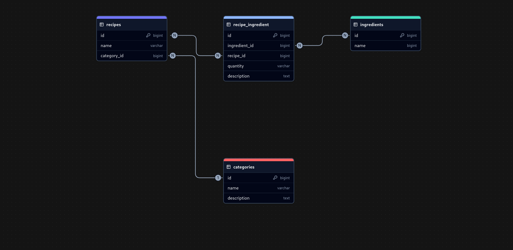

> [!WARNING]
> Currently, i still have not convenient in tailwind and popular frontend javascript framework. 2 Days is not enough to learn by doing. So this just html css only!

## ERD
 

## PHP built-in server

> [!IMPORTANT]
> Needed PHP ^8.2

```bash
git clone https://github.com/rizkyilhampra/recipe-restaurant.git
cd recipe-restaurant
composer install
cp .env.example .env
php artisan key:generate
php artisan migrate:fresh --seed
php artisan serve
```

## Docker (Through Sail)

> [!NOTE]
> Include PostgreSQL

```bash
git clone https://github.com/rizkyilhampra/recipe-restaurant.git
cd recipe-restaurant
```

```bash
composer install || docker run --rm \
    -u "$(id -u):$(id -g)" \
    -v "$(pwd):/var/www/html" \
    -w /var/www/html \
    laravelsail/php83-composer:latest \
    composer install --ignore-platform-reqs \
```

```bash
./vendor/bin/sail up -d
cp .env.example .env
./vendor/bin/sail artisan key:generate
./vendor/bin/sail artisan migrate:fresh --seed
```

## Test

> [!NOTE]
> Include phpstan, pint, and pest

```bash
composer run test
```

or with Sail

> Ensure the container is running, by running `./vendor/bin/sail up -d`

```bash
composer run sail-test
```
